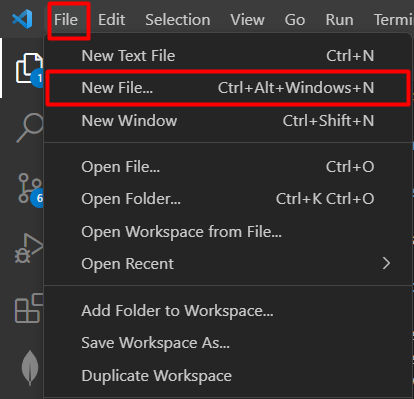
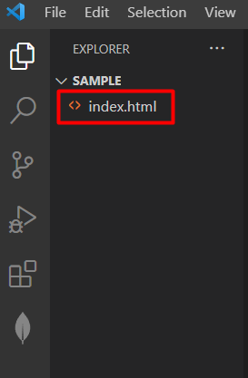
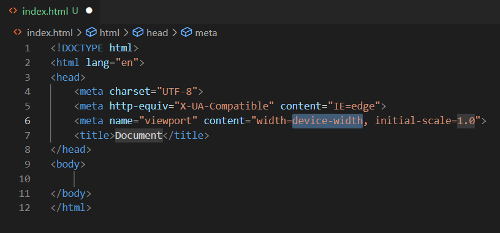
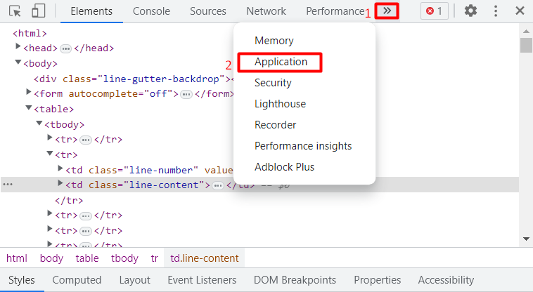

# Creating Unique Data

## Overview

This section will focus on creating and storing unique data -- the C of **C**RUD, an essential skill for front-end web development. To learn this skill, you will be applying it onto your browser's local storage.

## Setup

1. Create a folder on your computer (the folder can have any name).
2. Open VSC.
3. On the top left corner of VSC, click on File > Open Folder, and select your newly created folder.
    <br> 

4. Create an HTML file by clicking on File > New File..., and name it index.html.
    <br> 

5. Create a JavaScript file using File > New File; name it index.js.

    !!! tip "Important"
        You can name the JavaScript file any valid filename, however it is recommended to name it with the same name as the HTML file you plan to link it to. <br>
        **For the remainder of this tutorial, we will be referring to files and variables as named in this tutorial. Copying our code blocks may result in errors if you decide to name the files/variables on your own volition.**

## Creating and Storing Data

1. Open the HTML file by double clicking it on the explorer menu. If the menu is not visible, click on View > Explorer.
    <br> 

    !!! info "Tip"
        From steps 2 to 6, you may choose to follow the steps or you may copy the code block at the end of step 6.

2. In the code editor window, type '!', and hit enter.
    <br> 

    By this point, you should be seeing a template autogenerated by VSC.
    <br> 
    If it did not autogenerate, feel free to copy and paste the following block onto your HTML file.

    ```html
    <!DOCTYPE html>

    <html lang="en">
    <head>
        <meta charset="UTF-8">
        <meta http-equiv="X-UA-Compatible" content="IE=edge">
        <meta name="viewport" content="width=device-width, initial-scale=1.0">
        <title>Document</title>
    </head>
    <body>

    </body>
    </html>
    ```

3. In the HTML document head, insert a blank line after line 7.
4. Link your JavaScript file you created during the tutorial setup.
5. Create an input tag within the body of the HTML file. Give it an id attribute 'createInput'.
6. Create a button tag right below your input tag.

7. Give it the id attribute 'createButton', and the onClick attribute 'submitInput()', and put any text inside it.

    ```html
    <!DOCTYPE html>

    <html lang="en">

    <head>
        <meta charset="UTF-8">
        <meta http-equiv="X-UA-Compatible" content="IE=edge">
        <meta name="viewport" content="width=device-width, initial-scale=1.0">
        <title>Document</title>
        <script src="index.js"></script>
    </head>

    <body>
        <input id="createInput"></input>
        <button id="createButton" onClick="submitInput()">Click me!</button>
    </body>

    </html>
    ```

8. In your JavaScript file, create a function with the following code block:

    ```js
    function submitInput() {
        var input = document.getElementById("createInput").value;
        localStorage.setItem(input, JSON.stringify(input));
    }
    ```

9. Open your HTML file by dragging it into a compatible browser.
10. Type something into the input box.
11. Hit the button to submit the unique data into the browser’s local storage.

    ??? note "Checking local storage on Google Chrome"
        To check local storage data, you can right-click on a webpage and click on 'Inspect'.
        <br> 
        <br> This will open up a tab showing the HTML code of the webpage you are on. Click on the '>>' button, and select 'Application'.
        <br> 
        <br> Expand the 'Local Storage' tab of the 'Storage' section, and click on your local host address.
        <br> 
        <br> If you have data stored on your browser's local storage, then it should display on the right.

## Conclusion

Congratulations! If you made it to the end of this section with no issues, you have successfully created and stored data on your web browser's local storage.
