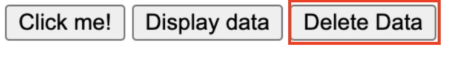

# Deleting Data

## Overview

This section will focus on reading data -- the D of CRU**D**. To learn this skill, you will be applying it onto the data that currently exists inside your browser's local storage.
!!! tip "Pre-requisites"
    This tutorial is a continuation on the [**reading tutorial**](reading.md). If you have not completed it, you will need to have setup data inside your browser's local storage on your own.
    <br> **There is no guarantee that the data you have entered on your own will be compatible with our code**. Continue at your own risk!

## Setup

1. Create a button tag in a new line below the existing button tags in your HTML file.

2. Give it an id attribute 'removeItem', an onClick event attribute 'removeItem()', and put any text inside.

    At this point, your HTML file should look like this.

    ```html hl_lines="17"
    <!DOCTYPE html>

    <html lang="en">

    <head>
        <meta charset="UTF-8">
        <meta http-equiv="X-UA-Compatible" content="IE=edge">
        <meta name="viewport" content="width=device-width, initial-scale=1.0">
        <title>Document</title>
        <script src="index.js"></script>
    </head>

    <body>
        <input id="createInput">
        <button id="createButton" onClick="submitInput()">Click me!</button>
        <button id="displayData" onClick="displayOutput()">Display data</button>
        <button id="removeItem" onClick="removeItem()">Delete Data</button>
    </body>

    </html>
    ```

3. Create a function called 'removeItem()' in your JavaScript file.

    ```js
    function removeItem() {

    }
    ```

## Delete Data from your Browser's Local Storage

1. Inside the function you created in the tutorial setup, removeOutput, insert the following code block.

    ```js
    function removeItem() {
        var item = document.getElementById('createInput');
        localStorage.removeItem(item);
        window.location.reload();
    }
    ```

    This is a function that will delete data stored in your browser's local storage.

    At this point, your JavaScript file contains the following:

    ```js
        function submitInput() {
    var input = document.getElementById("createInput").value;
    localStorage.setItem(input, JSON.stringify(input));
    }

    function displayOutput() {
        for (var i = 0; i < localStorage.length; i++) {
            var key = localStorage.key(i);
            var data = localStorage.getItem(key);
            console.log(data);
        }
    }

    function removeItem() {
        var item = document.getElementById('createInput');
        localStorage.removeItem(item);
        window.location.reload();
    }
    ```

2. Open your HTML by dragging it onto a compatible browser.
3. Open developer tools, and navigate to Application.
    <br> 
4. Click on your local host address under 'Local Storage' tab.
    <br> 
    At this point, you will see key value pairs. This represents the data stored on your browser's local storage.

    !!! failure "If you don't see any key value pairs..."
        Make sure you followed our previous tutorials to setup the data into your local storage, and that you are not working in the incognito mode of your browser. Check if your data creation function works by typing and submitting some data, and try removing that data.

    !!! tip "Local host address"
        Your local host address will typically be 127.0.0.1:XXXX, with XXXX being some four digit port number.
        <br> If you do not see this address on the list, look for another address that begins with 127 and check if they contain the data you are looking for.

5. Enter the name of the key linked to the value/data you want to remove into the input box.
    <br> 
6. Press the 'Delete Data' button.
    <br> 

    At this point, your browser will reload and the data will be deleted from the local storage.

    !!! success "Success"
        If you did the steps correctly, then your browser will reload and the data will be deleted from the local storage. Well done!

## Conclusion

Congratulations! If you made it to the end of this section with no issues, you have successfully deleted data on your web browser's local storage.
