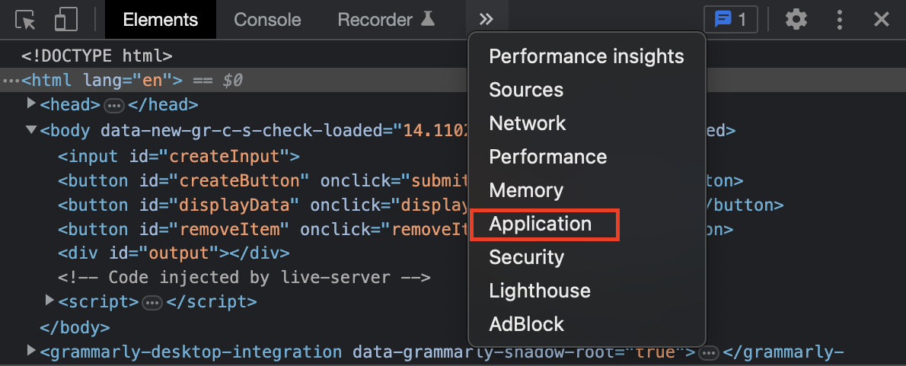
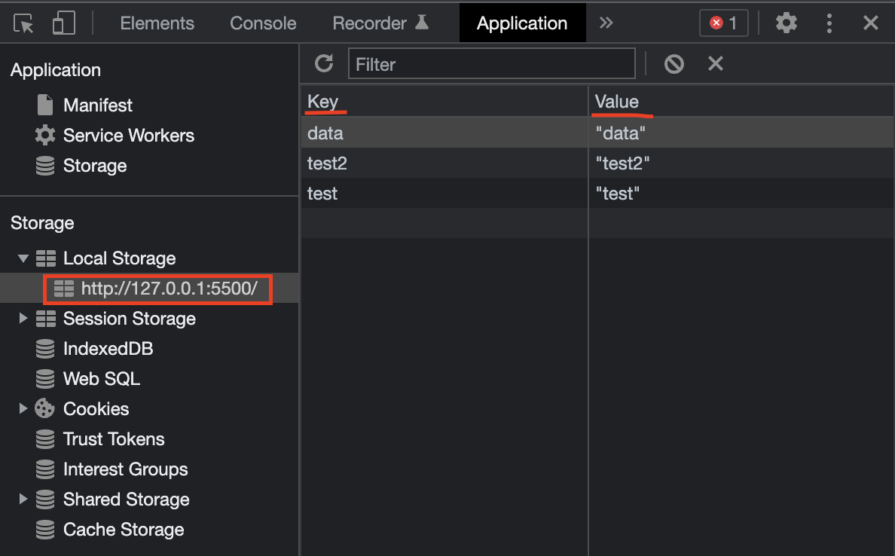
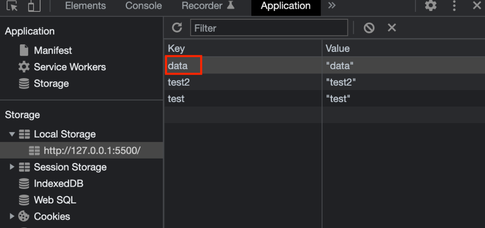

# Deleting Data

## Overview

This section will focus on reading data -- the D of CRU**D**. To learn this skill, you will be applying it onto the data that currently exists inside your browser's local storage.
!!! tip "Pre-requisites"
    This tutorial is a continuation on the [**reading tutorial**](reading.md). If you have not completed it, you will need to have setup data inside your browser's local storage on your own.
    <br> **There is no guarantee that the data you have entered on your own will be compatible with our code**. Continue at your own risk!

## Setup

1. Create a button tag in a new line below the existing button tags in your HTML file.

2. Give it an id attribute 'removeItem', an onClick event attribute 'removeItem()', and put any text inside.

    At this point, your HTML file should look like this.

    ```html hl_lines="17"
    <!DOCTYPE html>

    <html lang="en">

    <head>
        <meta charset="UTF-8">
        <meta http-equiv="X-UA-Compatible" content="IE=edge">
        <meta name="viewport" content="width=device-width, initial-scale=1.0">
        <title>Document</title>
        <script src="index.js"></script>
    </head>

    <body>
        <input id="createInput">
        <button id="createButton" onClick="submitInput()">Click me!</button>
        <button id="displayData" onClick="displayOutput()">Display data</button>
        <button id="removeItem" onClick="removeItem()">Delete Data</button>
    </body>

    </html>
    ```

3. Create a function called 'removeItem()' in your JavaScript file.

    ```js
    function removeItem() {

    }
    ```

## Delete Data from your Browser's Local Storage

1. Inside the function removeItem(), create a variable called 'item' and use the document.getElementById() method to retrieve data and store it in the 'item' variable.

    ```{.js hl_lines="2"}
    function removeItem() {
        var item = document.getElementById('createInput');
    }
    ```

2. Add the functionality to remove data from your local storage by using localStorage.removeItem().

    ```{.js hl_lines="3"}
    function removeItem() {
        var item = document.getElementById('createInput');
        localStorage.removeItem(item);
    }
    ```

3. Add the functionality to reload the window by using window.location.reload().

    ```{.js hl_lines="4"}
    function removeItem() {
        var item = document.getElementById('createInput');
        localStorage.removeItem(item);
        window.location.reload();
    }
    ```

4. Open your HTML by dragging it onto a compatible browser.
5. Open developer tools, and navigate to Application.
    <br> 
6. Click on your local host address under 'Local Storage' tab.
    <br> 
    At this point, you will see key value pairs. This represents the data stored on your browser's local storage.
7. Enter the key of the data you want to remove into the input box.
    <br> 
8. Press the 'Delete Data' button.

    At this point, your browser will reload and the data will be deleted from the local storage.

## Conclusion

Congratulations! If you made it to the end of this section with no issues, you have successfully deleted data on your web browser's local storage.
