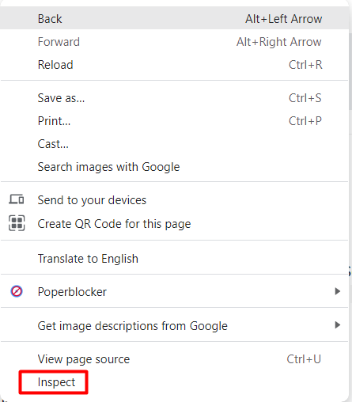
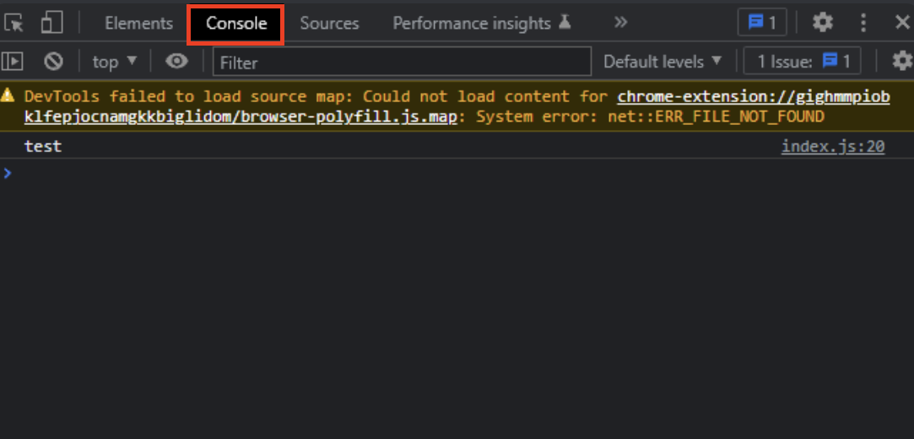

# Reading Data

## Overview

This section will focus on reading data -- the R of C**R**UD. To learn this skill, you will be applying it onto the data that currently exists inside your browser's local storage.
!!! warning "Pre-requisites"
    This tutorial is a continuation on the [**creating tutorial**](creating.md). If you have not completed it, you will need to have setup data inside your browser's local storage on your own.
    <br> **If you choose not to follow our previous tutorial, there is no guarantee that the data you have entered on your own will be compatible with our code**. Continue at your own risk!

## Setup

1. Create a button tag below the previous button tag in your HTML file.

2. Give it an id attribute 'displayData', an onClick event attribute 'displayOutput', and put any text inside it.

    At this point, you should have this in your HTML file.

    ```html
    <!DOCTYPE html>

    <html lang="en">

    <head>
        <meta charset="UTF-8">
        <meta http-equiv="X-UA-Compatible" content="IE=edge">
        <meta name="viewport" content="width=device-width, initial-scale=1.0">
        <title>Document</title>
        <script src="index.js"></script>
    </head>

    <body>
        <input id="createInput">
        <button id="createButton" onClick="submitInput()">Click me!</button>
        <button id="displayData" onClick="displayOutput()">Display data</button>
    </body>

    </html>
    ```

3. Define a function called 'displayOutput' in your JavaScript file.

    ```js
    function displayOutput() {
        
    }
    ```

## Display All Local Storage Data to the Console

These set of instructions will go over how to display everything saved to your browser's local storage.

1. Inside the function you created in the tutorial setup, displayOutput, insert the following code block.

    ```js
    function displayOutput() {
        for (var i = 0; i < localStorage.length; i++) {
            var key = localStorage.key(i);
            var data = localStorage.getItem(key);
            console.log(data);
        }
    }
    ```

    This is a loop that will let you access every variable inside your local storage.

    At this point, your JavaScript file contains the following:

    ```js
    function submitInput() {
    var input = document.getElementById("createInput").value;
    localStorage.setItem(input, JSON.stringify(input));
    }

    function displayOutput() {
        for (var i = 0; i < localStorage.length; i++) {
            var key = localStorage.key(i);
            var data = localStorage.getItem(key);
            console.log(data);
        }
    }
    ```

2. Open your HTML by dragging it onto a compatible browser.
3. Hit the 'Display data' button.
4. Right click on the webpage. This will open up a menu.
    <br> 
5. Open your browser's Developer Tools by clicking 'Inspect', or your browser's equivalent.
6. Navigate to the console tab.
    <br> 
    At this point, you will see all data stored in your browser's local storage.
    <br> 

    !!! failure "If you do not see anything in your local storage..."
        Make sure you are not working in incognito mode. If your local storage data was wiped, or you have not completed our creating tutorial, the data may not display. Please start again from our [creating](creating.md) tutorial if either of these are the case.

    !!! success "Success"
        If you did the steps correctly, you will see all data stored in your browser's local storage displayed in the console. Well done!

## Conclusion

Congratulations! If you made it to the end of this section with no issues, you have successfully read data on your web browser's local storage and displayed it using the browser's console.
