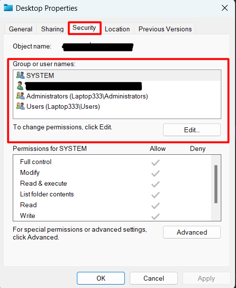

# Troubleshooting Guide

1. **I can't see any of the data after finishing the reading tutorial.**
  If you can't see the data on your console, make sure that you have properly added the data into the local storage. If you were working in incognito mode, it is possible that your data may have been wiped since the last time you opened your browser. If that is the case, you may have to start again.

2. **My browser doesn't have a developer tools function.**
  Install [**Google Chrome**](https://www.google.com/intl/en_ca/chrome/), [**Mozilla Firefox**](https://www.mozilla.org/en-CA/firefox/new/), [**Microsoft Edge**](https://www.microsoft.com/en-us/edge/download?form=MA13FJ) or any other browser that supports that function.

3. **I can't seem to run Visual Studio Code.**
  Make sure your system is running Windows, macOS, or Linux. Other OS's are not currently supported by Visual Studio Code.

4. **I can't make a new folder.**
      Make sure that you have permission to create a folder in the location you are attempting to create one in.

    ??? tip "On Windows 10..."
        You can check your permissions by right clicking the directory you want to create your folder in, and selecting 'Properties', and traversing to the 'Security' tab.
        

5. **I don't understand the terminology used in the tutorials.**
      There are finalized code blocks in each tutorial that you can copy directly onto your JavaScript or HTML files. If you wish to learn more about how they work, [W3Schools](https://w3schools.com/) is an excellent resource for learning HTML and JavaScript.

6. **Help! I'm getting a message about trusting the authors of the files!**
      
      That's totally fine! Since you are working on a folder that you created yourself, you know that there will not be any malicious files. You can click on 'Yes, I trust the authors', and proceed with our tutorials.
